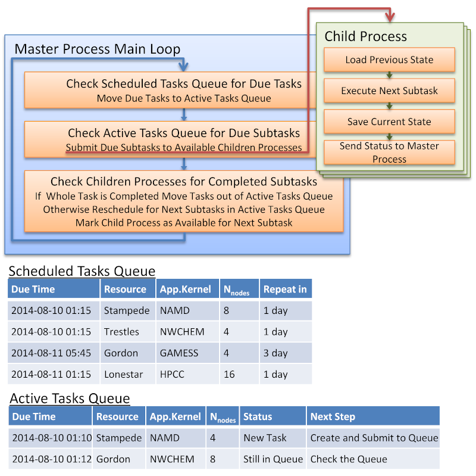

AKRR executes application kernels on HPC resources using the same mechanism as a regular user.
For example it uses ssh to access the system and submits job scripts through the system scheduler.
This allows for not only monitoring the performance of the application kernels themselves but 
also testing the whole workflow that regular users employ in order to carry out their work.

AKRR was designed to execute a large number of jobs on a number of HPC resources in 24/7 mode. 
To achieve high reliability, a multi-process design was chosen where the master process dispatches a 
small self-contained subtask to the children processes. 
This allows the master process code to be relatively simple and moves the more complicated code to the children processes. 
This way a severe error on one of the child processes does not cause the whole system to collapse.

**Table 1.** Subtasks of the Application Kernel Jobs.

| # | Subtask/step Description                                                                                                   |
|---|----------------------------------------------------------------------------------------------------------------------------|
| 1 | Create a job script                                                                                                        |
| 2 | Copy it to HPC resource and submit to queue.  Reschedule to repeat until success or allowed number of attempts is exceeded |
| 3 | Check job status on HPC resource.  Reschedule to repeat until job complete or allowed in-queue time is exceeded            |
| 4 | Collect the job output if it is present                                                                                    |
| 5 | Process the output if it was collected                                                                                     |
| 6 | Load results to database.  Reschedule to repeat until successs or allowed number of attempts is exceeded                   |

Although application kernels are computationally lightweight and their pure execution time lies between minutes to half an hour, 
the total time from job script creation to loading the results to the database can easily takes several days, 
due to potentially long queue wait times.
In order to manage a large number of jobs and to be able to recover from critical failures, 
the entire application kernel execution task is split into small
self-contained subtasks (see Table 1 for the subtasks). 
Each subtask is executed by a child process and should take only a few seconds. 
At the end of each subtask, the current job state is dumped to the file system. 
This allows us to recover to the last known state of AKRR in the case of a critical failure.

**Figure 1.**  Illustration of the AKRR (Application Kernel Remote Runner) master process main loop with example scheduled and active task queue
content.

The AKRR master process utilizes two queues for job tracking: the first one is named “scheduled tasks” and contains the jobs scheduled for
execution in the future; the second one is named “active tasks” and contains jobs which are currently executed (Figure 1). When the scheduled
time occurs, the job is moved from the scheduled tasks queue to the active tasks queue with the current due time. When a job in the active tasks
queue is due, the master process dispatches a subtask of this job to a child process. The child process executes the subtask; and in the case of a
successful execution, it requests the master process to schedule the next subtask for execution, otherwise the same subtask is rescheduled for
future execution. When all subtasks are completed or the allowed number of rescheduling attempts is exceeded the job is moved out of the active
tasks queue.

