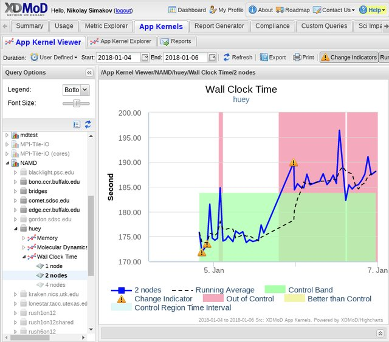

Application Kernel Performance Monitoring Module of XDMoD tool is designed to 
measure quality of service (QoS) as well as preemptively identify underperforming 
hardware and software by deploying customized, computationally lightweight 
“application kernels” that are run on a regular basis (daily to several times per week) 
to continuously monitor HPC system performance and reliability from the 
application users’ point of view. The term “computationally-lightweight” is used 
to indicate that the application kernel requires relatively modest resources for 
a given run frequency. Accordingly, through XDMoD, system managers have the 
ability to proactively monitor system performance as opposed to having to rely 
on users to report failures or underperforming hardware and software.

The XDMoD's application kernel performance monitoring consists of two parts: 
application kernel remote runner (AKRR) and XDMoD appkernel module (`xdmod-appkernels`).

Application kernel remote runner (AKRR) executes the scheduled jobs, 
monitors their execution, processes the output, extracts performance metrics 
and exports the results to the database.

XDMoD appkernel module analyse the results of application kernels runs, provides 
visualization tools and web-base interface to control AKRR. Among analysis tools it 
has automatic anomaly detector, that analyzes the performance of all application kernels 
executed on a resource and automatically recognizes poorly performing systems. 

[XDMoD](https://open.xdmod.org/) should be install first, then [AKRR](https://akrr.xdmod.org/) and 
then [xdmod-appkernels](https://appkernels.xdmod.org/). In addition before 
installing `xdmod-appkernels` module, add your HPC resource to AKRR and run few appkernels 
jobs, this will help to ensure that `xdmod-appkernels` is working properly.

# AKRR Documentation and Notes

* [Overview](index.md)
* [Download](AKRR_Download.md)
* [Installation](AKRR_Install.md)
* [Update](AKRR_Update.md)
* [Usage](AKRR_Usage.md)
  * [Adding HPC Resource](AKRR_Add_Resource.md)
  * [Deployment of Application Kernels on Resource](AKRR_Deployment_of_Application_Kernel_on_Resource.md)
    * [NAMD Deployment](AKRR_NAMD_Deployment.md)
    * [IMB Deployment](AKRR_IMB_Deployment.md)
    * [IOR Deployment](AKRR_IOR_Deployment.md)
    * [MDTest Deployment](AKRR_MDTest_Deployment.md)
    * [HPCC Deployment](AKRR_HPCC_Deployment.md)
    * [HPCG Deployment](AKRR_HPCG_Deployment.md)
    * [NWChem Deployment](AKRR_NWChem_Deployment.md)
    * [GAMESS Deployment](AKRR_GAMESS_Deployment.md)
    * [ENZO Deployment](AKRR_ENZO_Deployment.md)
    * [Creating New Application Kernel](AKRR_Creating_New_Application_Kernel.md)
  * [Scheduling and Rescheduling Application Kernels](AKRR_Tasks_Scheduling.md)
  * [Setting Walltime Limit](AKRR_Walltimelimit_Setting.md)
* Details
  * [How AKRR Operates](AKRR_HowItWorks.md)
  * [How Batch Job Script are Generated](AKRR_Batch_Job_Script_Generation.md)

<!---
  * [Adding OpenStack Resource and Application Kernels Deployment on it](AKRR_Add_OpenStack_Resource_and_AppKernels.md)
-->

XDMoD Application Kernel Performance Monitoring Publications 
-----------------

* Simakov, N. A., White, J. P., DeLeon, R. L., Ghadersohi, A., Furlani, T. R., Jones, M. D., Gallo, S. M., and Patra, A. K. (2015).
"Application kernels: HPC resources performance monitoring and variance analysis."
*Concurrency Computat.: Pract. Exper.*, 27: 5238– 5260. doi: [10.1002/cpe.3564](https://doi.org/10.1002/cpe.3564).

* Nikolay A. Simakov, Robert L. DeLeon, Joseph P. White, Thomas R. Furlani, Martins Innus, Steven M. Gallo, Matthew D. Jones, Abani Patra, Benjamin D. Plessinger, Jeanette Sperhac, Thomas Yearke, Ryan Rathsam, and Jeffrey T. Palmer. 2016.
"A Quantitative Analysis of Node Sharing on HPC Clusters Using XDMoD Application Kernels."
*In Proceedings of the XSEDE16 Conference on Diversity, Big Data, and Science at Scale (XSEDE16). Association for Computing Machinery*, New York, NY, USA, Article 32, 1–8. 
DOI: [10.1145/2949550.2949553](https://doi.org/10.1145/2949550.2949553)

* Nikolay Simakov and Martins D. Innus and Matthew D. Jones and Joseph P. White and Steven M. Gallo and Robert L. DeLeon and Thomas R. Furlani (2018).
"Effect of Meltdown and Spectre Patches on the Performance of HPC Applications"
*HPC Systems Professionals Workshop (HPCSYSPROS18) at SC18*.
[ArXiv: abs/1801.04329](https://arxiv.org/abs/1801.04329)

Next: [AKRR Download](AKRR_Download.md)
